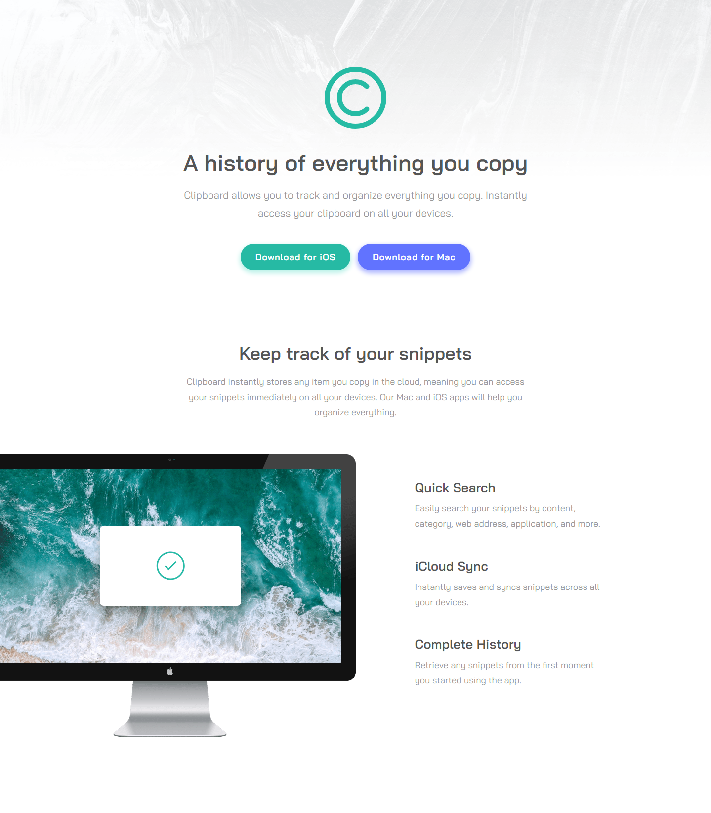

# Frontend Mentor - Clipboard landing page solution

This is a solution to the [Clipboard landing page challenge on Frontend Mentor](https://www.frontendmentor.io/challenges/clipboard-landing-page-5cc9bccd6c4c91111378ecb9). Frontend Mentor challenges help you improve your coding skills by building realistic projects. 

## Table of contents

- [Overview](#overview)
  - [The challenge](#the-challenge)
  - [Screenshot](#screenshot)
  - [Links](#links)
- [My process](#my-process)
  - [Built with](#built-with)
  - [What I learned](#what-i-learned)
  - [Useful resources](#useful-resources)
- [Author](#author)

## Overview

### The challenge

Users should be able to:

- View the optimal layout for the site depending on their device's screen size
- See hover states for all interactive elements on the page

### Screenshot

### Links

- Solution URL: [frontendmentor](https://www.frontendmentor.io/solutions/html-and-css-with-flexbox-xWEFPdlxw)
- Live Site URL: [franexmo81.github.io/clipboard-landing-page](https://franexmo81.github.io/clipboard-landing-page)

## My process

### Built with

- HTML5
- CSS3

### What I learned

- CSS fundamentals
- Responsive design
- Flexbox

### Useful resources

- [W3Schools](https://www.w3schools.com/) - A must-go reference when it comes to know how a specific HTML tag or CSS property works.
- [A Complete Guide to Flexbox](https://css-tricks.com/snippets/css/a-guide-to-flexbox/) - A comprehensive guide to CSS flexbox layout.
- [Stack Overflow](https://stackoverflow.com//) - A place to check when feeling stuck. Look for similar questions already posted or even ask your own one.

## Author

- Website - [Fran Extremera](http://franextremera.com/)
- Frontend Mentor - [@franexmo81](https://www.frontendmentor.io/profile/franexmo81)
